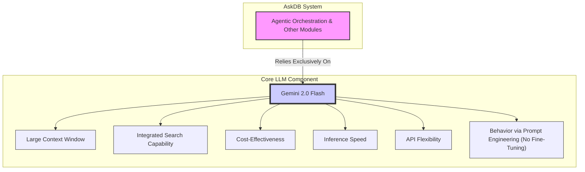
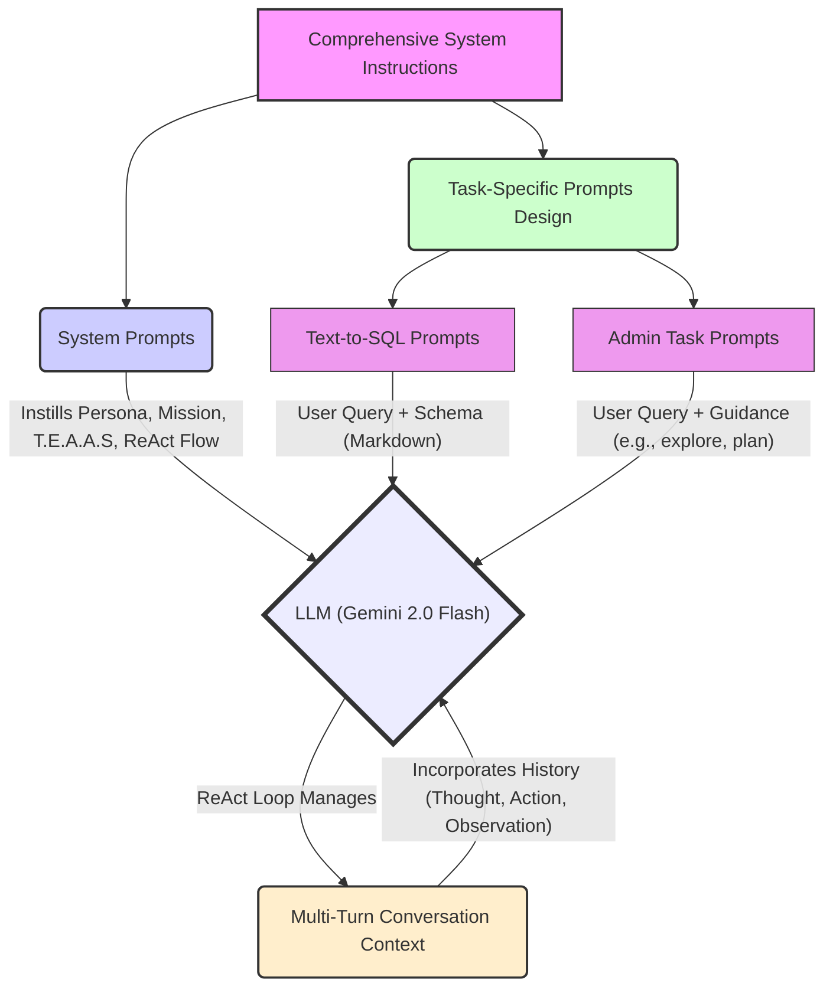
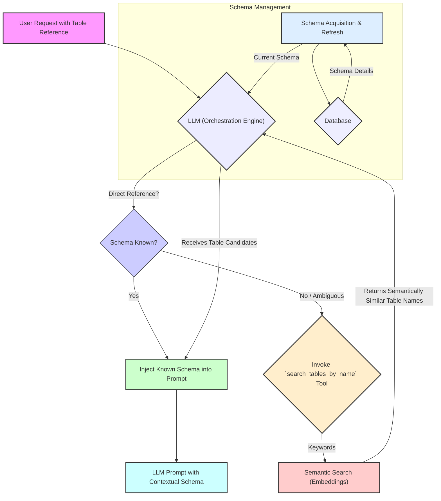
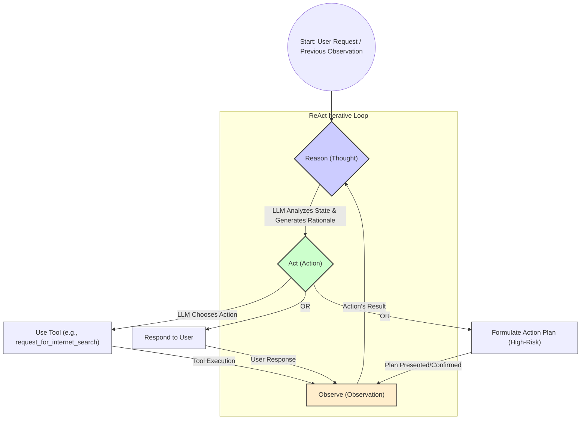
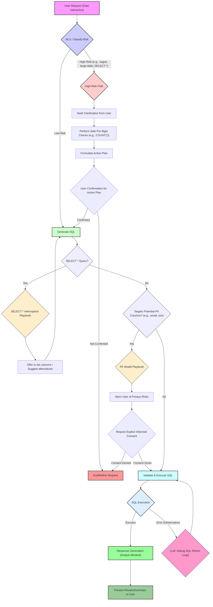
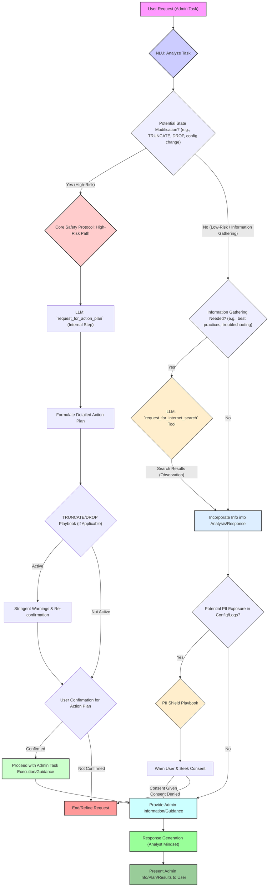
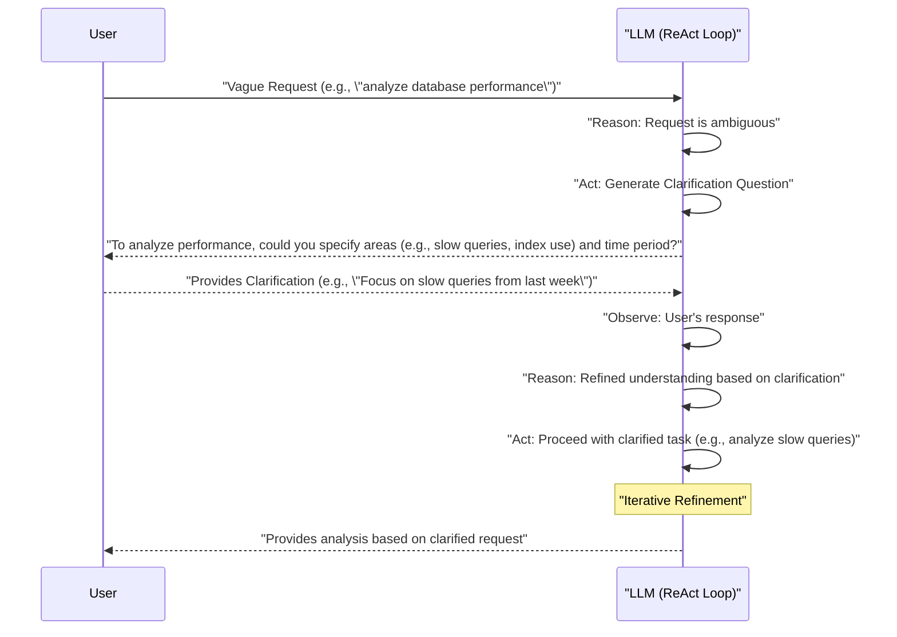

## **Abstract**

Interacting effectively with relational databases presents significant challenges for users with varying expertise, from formulating complex analytical queries to performing intricate administrative tasks. Current solutions often address either natural language querying or specific automation for database administration (DBA) tasks, lacking a unified, intelligent interface. This paper introduces **AskDB**, a novel LLM-powered agent designed to bridge this gap by providing comprehensive, autonomous support for diverse SQL database interactions, including both data analysis and simplified database administration through natural language. AskDB leverages **Gemini 2.0 Flash** large language model and incorporates key innovations: a **dynamic schema-aware prompting mechanism** (potentially enhanced by semantic search for schema elements) that intelligently utilizes database metadata, and a **task decomposition framework**. This framework enables AskDB to handle complex administrative operations by intelligently planning and executing multi-step actions, which includes capabilities like **auto-debugging generated SQL and autonomously performing real-time internet searches** to gather necessary information, research syntax, refine solutions, and even more. We demonstrate the efficacy of AskDB through extensive experiments on `Specific Text-to-SQL Benchmark` for data interaction, and `Specific Set of DBA Scenarios/Tasks` for administrative functions. Results show that AskDB achieves `Key Quantitative Result for Text-to-SQL` and `Key Quantitative Result for Admin Tasks`. 

The primary contributions of this work include: 
1. AskDB, a unified agent architecture effectively integrating natural language data analysis and relational database administration capabilities.
2. Novel methodologies for schema-aware prompting and an orchestrated, resourceful agentic framework for database interaction, incorporating features like auto-debugging and internet-augmented problem-solving.
3. A comprehensive evaluation demonstrating AskDB's proficiency across both complex analytical query generation and practical database administration scenarios. This research paves the way for more intuitive, efficient, and democratized access to, and management of, relational database systems.

> ##### `Specific Text-to-SQL Benchmark`
> *Example: "the Spider benchmark and a custom dataset of complex analytical queries tailored for financial data analysis (FinanceBench)" or "the BIRD benchmark focusing on execution with diverse SQL constructs."*
> 
> ##### `Specific Set of DBA Scenarios/Tasks`
> *Example: "a curated suite of 20 common PostgreSQL administration tasks covering areas like performance diagnostics (e.g., index suggestion, slow query analysis), user and security management (e.g., role creation, permission auditing), and backup/recovery procedure generation" or "simulated database failure scenarios to evaluate recovery assistance."*
> 
> ##### `Key Quantitative Result for Text-to-SQL`       
> *Example: "85% execution accuracy on complex queries within FinanceBench, outperforming the GPT-4 baseline by 10 percentage points" or "a 90% exact match accuracy on the Spider development set."*
> 
> ##### `Key Quantitative Result for Admin Tasks`
> *Example: "successfully automates 90% of the defined administrative tasks with 95% correctness in generated scripts/commands, reducing estimated manual effort by an average of 30 minutes per task compared to manual execution" or "identified critical security misconfigurations in 5 out of 5 test scenarios."*

Okay, I will now rewrite the Introduction section, replacing the generic placeholders with the more specific (though still illustrative) BibTeX key placeholders we just generated.

Remember, the goal here is to show how the text would look with these integrated. For your actual paper, you'd ensure each citation perfectly supports the statement.

---

## 2. Introduction

Relational databases are the backbone of modern information systems, safeguarding vast quantities of data crucial for organizational operations and strategic decision-making. However, the primary means of interacting with these databases, Structured Query Language (SQL), often presents a significant barrier, limiting the ability of many potential users to directly access and leverage this valuable data. This section outlines the multifaceted challenges in database interaction and administration, establishes the pressing need for a more intuitive solution, and introduces our proposed LLM-powered agent, AskDB, along with its key contributions.

### 2.1. Motivation & Background

The difficulties associated with SQL and database management are pervasive, affecting a wide spectrum of users from non-technical staff to seasoned IT professionals. These challenges often lead to inefficiencies, underutilization of data assets, and increased operational burdens.

First, for many non-technical users, business analysts, and decision-makers, the **steep SQL learning curve and inherent schema complexity** are primary deterrents. Studies and observations consistently highlight that SQL syntax and the need to understand database structures pose significant hurdles. Understanding the correct syntax and navigating potentially hundreds of tables and their relationships is a formidable task, leading to frustration and a reluctance to engage with data directly. Consequently, this creates **operational bottlenecks and a heavy dependency on technical intermediaries**. Business users requiring data for timely decisions often face delays waiting for IT departments or data analysts to fulfill their requests, hindering agility and the adoption of a truly data-driven culture. Improving data accessibility has been shown to significantly enhance decision-making and operational efficiency.

Second, on the operational side, Database Administrators (DBAs) are frequently encumbered by a multitude of **repetitive and time-consuming tasks**. Routine activities such as health checks, user account management, applying standard permissions, and basic performance monitoring, while essential for system stability and security, consume a significant portion of their time. This operational load detracts from more strategic responsibilities like robust database design, proactive performance optimization, security hardening, and long-term capacity planning.

Third, even for users proficient in SQL, such as data analysts, data scientists, and software developers, **crafting and optimizing complex data queries** for large, multifaceted datasets remains a non-trivial challenge. Writing efficient queries involving multiple joins, nested subqueries, and advanced functions requires deep expertise and can be error-prone and time-consuming. Debugging such queries or adapting them to evolving business requirements further adds to the complexity and development lifecycle. The performance of these queries is critical, as poorly optimized queries can lead to significant system slowdowns.

Finally, all technical staff involved with databases, particularly DBAs, face the constant **struggle of keeping pace with and managing evolving, complex database environments**. The rapid advancements in database technologies, the proliferation of cloud-native database services, diverse data models, and stringent security compliance mandates necessitate continuous learning and adaptation. The sheer scale of data, often termed "Big Data," further amplifies these issues, overwhelming traditional relational databases and demanding new management strategies.

The confluence of these challenges—ranging from basic data access for novices to intricate management for experts—highlights a clear need for more intelligent, accessible, and efficient ways to interact with and administer database systems.

Fortunately, the recent advancements in Large Language Models (LLMs) offer a transformative opportunity to address these long-standing issues. LLMs have demonstrated remarkable capabilities in natural language understanding, complex reasoning, and, crucially, code generation, including SQL. Their ability to process natural language instructions and translate them into structured queries, or even sequences of administrative commands, opens up new paradigms for human-computer interaction with databases. This has led to a resurgence of interest in Natural Language Interfaces to Databases (NLIDBs), now supercharged by the power and flexibility of LLMs, aiming to democratize data access and streamline database operations.

### 2.2. Problem Statement

Despite the promise of LLMs, a significant gap remains in providing a holistic, intelligent, and autonomous solution that seamlessly bridges the interaction divide for a diverse range of database-related tasks. There is a pressing need for an agent that not only assists non-technical users in querying data through natural language but also empowers technical users and DBAs by simplifying complex query generation, offering insights from data, and aiding in multifaceted database administration tasks. Such an agent must understand user intent across these varied domains, interact intelligently with database schemas, generate accurate and safe operations, and function with a useful degree of autonomy.

### 2.3. Proposed Solution - High-Level Overview

To address these challenges, this paper introduces **AskDB**, a novel LLM-powered agent designed for simplified relational database administration and data analysis using natural language interaction. AskDB leverages the capabilities of the **Gemini 2.0 Flash** large language model to act as a versatile assistant for a wide array of database tasks.

AskDB's core design provides dual capabilities:

1.  **Data Interaction Assistant:**
    *   **Natural Language to SQL (NL2SQL):** Accurately translates user questions posed in natural language into executable SQL queries.
    *   **Data Summarization & Insight Generation:** Processes query results to provide concise summaries or highlight potential insights.
    *   **Data Checking & Validation Assistance:** Helps users formulate queries to check data quality or validate assumptions.
    *   **Schema Exploration Support:** Enables users to ask questions about the database schema itself (e.g., "What tables contain customer information?").

2.  **Database Administration Co-pilot:**
    *   **Simplified Task Execution:** Assists with common DBA tasks like user management (creating users, granting permissions), performance monitoring (identifying slow queries, suggesting index creation based on workload patterns), and security checks (auditing permissions, identifying potential misconfigurations).
    *   **Script Generation & Explanation:** Generates administrative scripts (e.g., for backup procedures, schema migrations) and can explain the purpose and function of existing scripts or database commands.
    *   **Troubleshooting Assistance:** Aids in diagnosing common database issues by interpreting error messages or analyzing logs, leveraging its knowledge base and real-time search capabilities.

AskDB is built upon key design principles including **accuracy** in SQL generation and task execution, **user-centricity** in its conversational interaction, **safety** mechanisms particularly for administrative operations (e.g., generating commands for review before execution), **adaptability** to different SQL dialects and database schemas through dynamic schema-aware prompting, and **resourcefulness** via its task decomposition framework and ability to perform internet searches for up-to-date information or troubleshooting.

### 2.4. Novelty & Contributions

This research makes several key contributions to the field of AI-driven database interaction:

1.  **Unified Agent Architecture (AskDB):** We propose and implement AskDB, a novel agent architecture that cohesively integrates natural language-driven data analysis with relational database administration capabilities within a single framework. This contrasts with most existing systems that typically focus on either Text-to-SQL or specific AI-driven DBA automation tools in isolation.
2.  **Advanced Methodologies for LLM-Database Interaction:** We introduce and evaluate novel techniques for enhancing LLM performance in the database context, specifically:
    *   A **dynamic schema-aware prompting mechanism** that intelligently incorporates relevant schema information (tables, columns, types, relationships, and descriptions, potentially enhanced by semantic search for schema elements) into the LLM's context for more accurate SQL generation and schema understanding.
    *   A **task decomposition framework (agent orchestration)** enabling AskDB to handle complex multi-step administrative operations, perform auto-debugging of generated SQL, and autonomously utilize tools like real-time internet search to gather necessary information or refine solutions.
3.  **Comprehensive Multi-faceted Evaluation:** We conduct a thorough evaluation of AskDB across diverse tasks, demonstrating its proficiency in both complex analytical query generation (using `[Specific Text-to-SQL Benchmark]`) and practical database administration scenarios (using `[Specific Set of DBA Scenarios/Tasks]`). This provides a holistic view of the agent's capabilities and its advantages over relevant baselines.
4.  **Demonstration of Broader Applicability:** Our work showcases the potential of advanced LLM agents to significantly simplify and democratize a wider range of interactions with complex software systems beyond just Text-to-SQL, particularly in system administration and operational support.

### 2.5. Paper Structure

The remainder of this paper is organized as follows: Section 3 reviews related work in natural language interfaces to databases, LLM-based agents, and AI in database management. Section 4 details the architecture and core methodologies of our proposed AskDB agent. Section 5 describes the experimental setup, including datasets, evaluation metrics, and baselines. Section 6 presents and discusses the results of our comprehensive evaluation. Finally, Section 7 concludes the paper, summarizing our findings and outlining directions for future research.

---

## 4. System Design Overview: The AskDB Agent Architecture

This section details the architecture and core components of AskDB, our proposed LLM-powered agent designed for unified data analysis and database administration. AskDB's architecture is fundamentally rooted in a set of **Prime Directives** and a **Core Safety Protocol** (as detailed in its operational instructions), ensuring every user interaction is processed with an emphasis on safety, clarity, user empowerment, integrity, and responsiveness. These tenets are encapsulated in its **T.E.A.A.S. (Thorough, Effective, Easy, Accurate, Safe) guiding principles**. The system leverages an operational loop inspired by the ReAct (Reason, Act) framework to orchestrate its complex reasoning, tool utilization, and observation-driven interactions.

### 4.1. Overall Architecture

AskDB operates as a modular system, where each component plays a distinct role within the overarching ReAct-driven workflow. The agent's core identity is that of an expert-level Database Administrator (DBA) and data analyst. A high-level conceptual diagram of AskDB's architecture is presented in Figure X *(Note: A diagram should be created and inserted here)*.

The key modules are:

*   **User Interaction Layer:** The interface for user communication, handling natural language input and presenting AskDB's responses, including explanations, data summaries, insights, and crucial Action Plans for user confirmation before any high-risk operations.
*   **Natural Language Understanding (NLU) Core & Intent Analyzer:** Powered by Gemini 2.0 Flash, this stage deconstructs the user's request, identifies core intent, and classifies the request's risk level per the **Core Safety Protocol**.
*   **Agentic Orchestration Engine (ReAct Framework):** This central cognitive loop enables AskDB to iteratively: (1) **Reason** about the task, (2) Decide on an **Action** (e.g., use a tool, respond to user), and (3) Process the **Observation** from that action to inform subsequent steps. This LLM-driven process governs tool selection and task sequencing.
*   **Schema Understanding & Integration Module:** This module grounds the LLM in the database context. It acquires schema information and features a `search_tables_by_name` tool that implements **semantic search**. When faced with ambiguous table references, the LLM can invoke this tool with keywords; the tool uses a local embedding model to find and return semantically similar table names, aiding schema exploration, particularly for large databases. Schema information is, by default, re-fetched every session for currency, with user-configurable refresh intervals.
*   **SQL Generation & Validation Module:** Generates SQL queries, which are subsequently validated for syntax and adherence to safety protocols, including "The PII Shield" playbook.
*   **Database Administration (Admin) Task Module:** Guides the LLM to generate commands, scripts, or multi-step Action Plans for administrative tasks, all subject to the High-Risk path of the Core Safety Protocol.
*   **Tool Arsenal:** AskDB utilizes a defined set of tools as per its **Tool Usage Strategy**. These tools, critical for augmenting LLM capabilities, include: `execute_query` (for `SELECT`), `execute_non_query` (for DML/DDL), `get_table_structure`, `search_tables_by_name`, `get_user_permissions`, `request_for_action_plan` (internal LLM call for complex planning), and `request_for_internet_search` (leveraging external knowledge, a common feature in advanced agents).
*   **Response Generation Module:** Employs the LLM to formulate clear, helpful natural language responses, aiming for an "analyst mindset."

AskDB currently does not implement an explicit mechanism for automated learning from direct user feedback.

### 4.2. Core LLM Component

> *The core LLM component of AskDB, highlighting its capabilities and role in the system.*

AskDB utilizes **Gemini 2.0 Flash** as its core LLM, selected for its large context window, integrated search capabilities (usable by the `request_for_internet_search` tool), cost-effectiveness, inference speed, and API flexibility. AskDB relies exclusively on **prompt engineering** with Gemini 2.0 Flash, without model fine-tuning, to elicit its designed behaviors.

The LLM's capabilities are harnessed through a comprehensive set of system instructions and task-specific prompts, which guide its behavior in generating SQL queries, administrative commands, and responses to user queries. The LLM's large context window allows it to maintain multi-turn conversation context, incorporating history (thoughts, actions, observations) into each reasoning step, essential for complex interactions.

### 4.3. Prompt Engineering / Instruction Design

> *How system instructions and task-specific prompts are designed and utilized by the LLM, with ReAct managing conversational context.*

AskDB's behavior is primarily shaped by its comprehensive system instructions, which detail its operational framework. Key aspects of instruction design include:

*   **System Prompts:** A foundational prompt instills AskDB's persona, its mission, adherence to T.E.A.A.S. principles, and the ReAct operational flow, crucial for guiding LLM behavior.
*   **Task-Specific Prompts:** For Text-to-SQL, prompts combine user queries with relevant schema information (formatted in markdown table syntax). For administration tasks (e.g., "provide insight about the performance of the database server last month"), prompts direct the LLM towards research and planning, e.g., *"Based on the current context... explore in the database or the internet... then provide the action plan for user confirmation."*
*   **Multi-Turn Conversation Context:** The ReAct framework inherently manages conversational context by incorporating the history of thoughts, actions, and observations into the prompt for each reasoning step.

### 4.4. Schema Integration and Grounding

> *How schema integration works, including direct references, semantic search for ambiguous table names, and dynamic schema management.*

Effective grounding in the database schema is achieved via a **dynamic schema-aware prompting mechanism**:

*   **Schema Acquisition & Refresh:** Schema details are fetched and refreshed regularly.
*   **Semantic Schema Exploration:** The `search_tables_by_name` tool, utilizing text embeddings for semantic similarity, allows the LLM to discover relevant tables even when user references are imprecise, a known challenge in Text-to-SQL systems.
*   **Contextual Schema Injection:** Relevant schema portions, identified via direct reference or semantic search, are formatted and injected into the LLM's prompt, similar to techniques used in Retrieval Augmented Generation (RAG) to provide external knowledge.
*   **LLM Prompting with Schema Context:** The LLM receives a prompt that includes the user query and the contextual schema, enabling it to generate accurate SQL queries or administrative commands based on the current database structure.
*   **Handling Ambiguity:** If the LLM encounters an ambiguous table reference, it can invoke the `search_tables_by_name` tool with keywords, which returns semantically similar table names, allowing the LLM to refine its understanding and proceed with the task.
*   **Dynamic Schema Updates:** The schema is re-fetched at the start of each session, ensuring the LLM operates with the most current database structure, which is crucial for accurate query generation and task execution.
*   **AskDB's Role:** As an expert-level agent, AskDB not only generates SQL queries but also explains the schema context to users, enhancing their understanding of the database structure and improving query accuracy.

### 4.5. Agentic Orchestration and Tool Use (ReAct Framework)

> *The ReAct framework's operational loop, illustrating the Reason, Act, and Observe cycle that guides AskDB's decision-making and tool use.*

AskDB’s core operational loop strictly adheres to the **ReAct (Reason, Act) framework**, enabling complex problem-solving and tool integration:

1.  **Reason (Thought):** The LLM analyzes the current state and generates a rationale for its next step.
2.  **Act (Action):** The LLM chooses an action: using a tool from its arsenal, responding to the user, or formulating an Action Plan for high-risk operations. Tool selection (e.g., `request_for_internet_search` for external knowledge) is LLM-driven based on its reasoning.
3.  **Observe (Observation):** The action's result becomes an observation, informing the next ReAct cycle.

This iterative process supports sophisticated behaviors like multi-step task decomposition and transparent planning, allowing AskDB to handle complex queries and administrative tasks effectively.

### 4.6. Handling Data Interaction Tasks

> *How AskDB handles data interaction tasks, including risk classification, high-risk path management, PII shielding, and SQL execution with error handling.*

The **Core Safety Protocol** governs data interaction:

*   **Risk Classification:** Requests are classified as "Low-Risk" or "High-Risk."
*   **High-Risk Path:** Most `SELECT` queries (due to table size, vague conditions, or `SELECT *`) trigger the High-Risk path, mandating clarification, safe pre-flight checks (e.g., `COUNT(*)`), an Action Plan, and explicit user confirmation.
*   **`SELECT *` Interception Playbook:** This specialized protocol discourages broad `SELECT *` queries by first offering to list columns, aligning with best practices for minimizing data exposure and improving query performance.
*   **PII Shield Playbook:** When queries target columns potentially containing Personally Identifiable Information (PII) (e.g., `email`, `ssn`), AskDB activates its "PII Shield." This involves warning the user of privacy risks and requiring explicit informed consent before retrieving such data, reflecting principles of privacy-preserving data access.
*   **SQL Generation, Validation & Debugging:** Generated SQL is validated. Execution errors (observations) are fed back to the LLM within the ReAct loop for correction attempts.
*   **Response Generation:** Results are summarized with an "analyst mindset."
*   **AskDB's Role:** As an expert-level data analyst, AskDB not only generates SQL queries but also explains their purpose, suggests optimizations, and provides insights based on query results. It can also assist in debugging complex queries, enhancing user understanding and trust.

### 4.7. Handling Database Administration Tasks

> *How AskDB handles database administration tasks, including high-risk operations, action plans, and PII shielding.*

AskDB's approach to database administration tasks is governed by its **Core Safety Protocol** and specialized playbooks, ensuring safe and effective handling of potentially high-risk operations:

*   **NLU Analysis:** The LLM first analyzes the request to determine if it involves potential state modification (e.g., `TRUNCATE`, `DROP`, configuration changes). If so, it follows the High-Risk path.
*   **High-Risk Path:** For high-risk operations, the LLM invokes the `request_for_action_plan` internal step to formulate a detailed Action Plan. This plan includes stringent warnings and re-confirmation steps, particularly for destructive operations like `TRUNCATE` or `DROP`, as outlined in the **TRUNCATE/DROP Double-Confirmation Playbook**.
*   **User Confirmation:** The user must confirm the Action Plan before proceeding with execution. If not confirmed, the request is refined or ended.
*   **Information Gathering:** For tasks that do not modify state, the LLM assesses if additional information is needed (e.g., best practices, troubleshooting). If so, it uses the `request_for_internet_search` tool to gather relevant data, which is then incorporated into its analysis or response.
*   **PII Shield:** If the task involves potentially sensitive configuration or log data, AskDB activates its PII Shield. This includes warning the user about privacy risks and requiring explicit informed consent before providing any sensitive information.
*   **Response Generation:** The final response is generated with an "analyst mindset," providing clear, actionable insights or plans based on the user's request and the gathered information.
*   **AskDB's Role:** As an expert-level DBA and data analyst, AskDB assists users in understanding complex administrative tasks, generating scripts, and providing insights into database performance or security. It can also explain the purpose of existing scripts or commands, enhancing user understanding and empowerment.

### 4.8. Managing Ambiguity and Clarification

> *How AskDB handles ambiguity in user requests, generating clarification questions and refining understanding iteratively.*

Adhering to its **Prime Directive on CLARITY**, AskDB addresses ambiguity:

*   **Detection & Clarification Action:** If a request is vague, the LLM, as part of its ReAct loop, generates a natural language question to seek clarification from the user. For example, for "analyze database performance," it might ask about specific areas of interest (e.g., slow queries, index use) and time periods.
*   **Iterative Refinement:** The user's response becomes an observation, allowing the LLM to refine its understanding. Responses and clarifications are currently text-based.
*   **Iterative Process:** This process continues until the LLM has sufficient clarity to proceed with the task, ensuring that user intent is accurately captured and addressed.
*   **Final Response Generation:** Once clarity is achieved, the LLM generates a response that directly addresses the user's refined request.
*   **User Empowerment:** This approach not only enhances the accuracy of the agent's responses but also empowers users by involving them in the clarification process, ensuring their needs are met effectively.
*   **AskDB's Role:** As an expert-level agent, AskDB guides users through complex queries and administrative tasks, ensuring they understand the context and implications of their requests. It can also explain the rationale behind its clarifications, enhancing user trust and engagement.