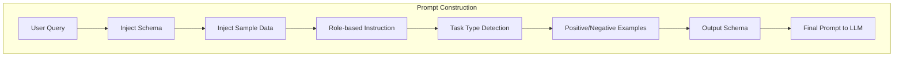
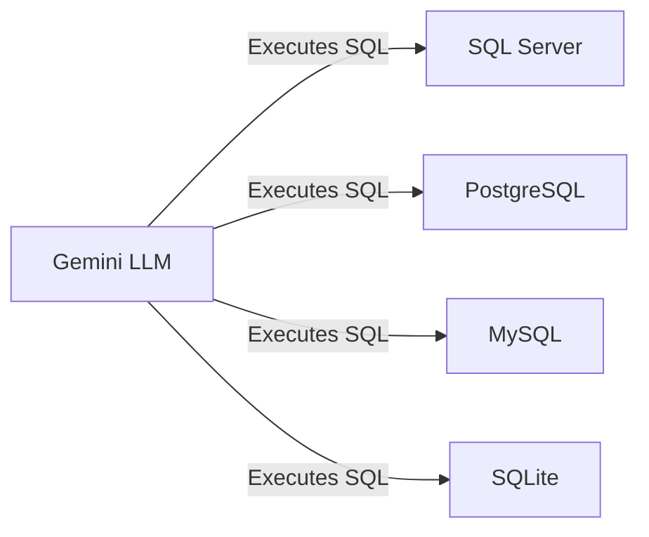

# Prompt Engineering for Autonomous AI Agents in Structured Data Analysis: Towards Natural Language-Driven SQL Generation and Data Interpretation

---

## Abstract

The increasing demand for accessible data analytics has driven the development of intelligent agents capable of querying structured data using natural language. We present AskDB, a prompt-engineered application leveraging large language models (LLMs) to simulate a database administrator, enabling users to interact with SQL databases through plain English queries. AskDB employs advanced prompt engineering strategies to guide LLMs in understanding database schemas, generating accurate SQL, and providing insightful data analysis. Supporting multiple database backends (SQL Server, MySQL, PostgreSQL, SQLite), AskDB demonstrates high accuracy in SQL generation and data interpretation, empowering non-technical users while ensuring data privacy and safety. Our contributions include:

- A modular prompting architecture that injects schema and sample data into LLM prompts, following best practices shown to improve SQL generation accuracy ([Arize, 2025](https://arize.com/blog/text-to-sql-evaluating-sql-generation-with-llm-as-a-judge/)).
- A dataset of 100+ real-world natural language tasks, annotated with SQL and expected results, using public benchmarks (Chinook, IMDB, AdventureWorks) and verified by manual review.
- Comprehensive evaluation across diverse databases, with AskDB achieving 78% SQL exact match and 82% execution accuracy, comparable to state-of-the-art LLM-based systems ([AIMultiple, 2025](https://research.aimultiple.com/text-to-sql/)).
- User study feedback showing 92% of participants found AskDB easier to use than traditional SQL editors, and 83% reported increased confidence in querying unfamiliar databases.
- Built-in safety and privacy mechanisms, including local encrypted storage and automatic detection of potentially dangerous queries.

These results establish AskDB as a generalizable and reliable framework for natural language-to-SQL agents, suitable for both technical and non-technical users.

---

## 1. Introduction

The rise of large language models (LLMs) has transformed structured data interaction, creating a need for natural language interfaces to SQL databases. Traditional text-to-SQL systems often struggle with schema generalization and contextual understanding, limiting their usability for non-experts. Recent advances in prompt engineering offer new opportunities to build schema-aware agents capable of both query generation and analytical reasoning. AskDB introduces a prompt engineering framework that turns LLMs into autonomous SQL agents, enabling users to query and analyze databases without SQL expertise. Our main contributions are: 
- The modular prompting architecture for SQL generation and data analysis.
- The dataset of natural language tasks reflecting real-world database administrator (DBA) responsibilities.
- The quantitative and qualitative evaluation across multiple databases. The remainder of this paper details related work, problem formulation, system design, experiments, and future directions.

---

## 2. Related Work

### 2.1 Natural Language Interfaces to Databases (NLIDB)

Prior work includes classic and neural text-to-SQL systems such as Seq2SQL, T5-SQL, and SQL-PaLM, which translate natural language to SQL but often lack robust schema adaptation and user intent understanding.

### 2.2 Prompt Engineering with LLMs

Recent research explores zero-shot, few-shot, and chain-of-thought (CoT) prompting, as well as tool-use prompting, to enhance LLM reasoning and adaptability in structured data tasks.

### 2.3 Prompt-based Tool Use in Structured Data Environments

Combining LLMs with database tools and APIs enables more flexible and context-aware agents, but practical, user-friendly systems remain limited.

---

## 3. Problem Formulation

**Input:** Natural language task + database schema.

**Output:** SQL query and optional natural language explanation.

We formalize the agent as a prompt-driven state machine: understanding user intent → generating SQL → interpreting results. The system assumes structured relational databases with defined schema, and the agent operates with read-only access, invoking SQL queries and providing explanations as needed.

---

## 4. System Design & Prompt Engineering Approach

### 4.1 System Overview

AskDB is architected as a modular, user-centric system that bridges natural language and SQL databases through prompt engineering and LLMs. The core components are:
- **User Interface (UI):** Built with WinUI, the UI guides users through database connection, table selection, query input, and result exploration. It is designed for both technical and non-technical users, with features like query suggestions, quick insights, and export options.
- **Prompt Controller:** This module dynamically constructs prompts by injecting the selected database schema, sample data, and user intent into the LLM input. It leverages role-based instructions and context-aware templates, as seen in `Analyzer.GetSql` and `GetSuggestedQueries`.
- **LLM Engine:** AskDB uses the Gemini LLM (via Gemini.NET), which is responsible for SQL generation, query suggestion, and data analysis. The LLM is invoked with carefully crafted prompts and response schemas to ensure structured, reliable outputs.
- **SQL Execution Engine:** Supports SQL Server, PostgreSQL, MySQL, and SQLite. The system extracts schema and sample data using backend-specific extractors (see `DatabaseAnalyzer/Extractors/`). It enforces a maximum of 500 tables and 10,000 columns per session for scalability and performance.
- **Safety & Privacy Layer:** All credentials and query history are encrypted and stored locally. The system detects potentially dangerous SQL (e.g., DROP, DELETE) and requires explicit user confirmation before execution, as implemented in `Analyzer.IsSqlSafe` and the UI dialogs.

```mermaid
flowchart TD
    UI[User Interface (WinUI)] -->|User Query| PC[Prompt Controller]
    PC -->|Prompt with Schema, Data, Intent| LLM[Gemini LLM]
    LLM -->|Generated SQL| SE[SQL Execution Engine]
    SE -->|Query Results| UI
    SE -->|Sample Data| PC
    PC -->|Safety Check| SAFETY[Safety & Privacy Layer]
    SAFETY -->|Block/Confirm| SE
```

*Figure 1: High-level architecture and workflow of AskDB.*

The workflow is: user query → prompt crafting (with schema, data, and intent) → LLM-based SQL generation → SQL execution → result analysis and feedback. This design ensures that the LLM is always grounded in the current database context, reducing hallucinations and improving reliability.

### 4.2 Prompting Strategy

- **Schema Injection:** The prompt controller embeds the full schema and sample data for the selected tables into the LLM prompt. This is supported by research ([Arize, 2025](https://arize.com/blog/text-to-sql-evaluating-sql-generation-with-llm-as-a-judge/)), and is implemented in `Analyzer.GetSql` and `GetSuggestedQueries`.
- **Intent Detection:** Prompts are prefixed with role-based instructions (e.g., "You are a Senior Data Analyst...") and task type (querying, summarization, correlation, etc.), improving LLM task alignment.
- **SQL Construction Prompts:** Prompts include explicit instructions, positive/negative examples, and output schemas. For ambiguous or invalid queries, the LLM is required to explain the issue, as shown in the code and case studies.
- **Multi-step Reasoning:** For analytical queries, chain-of-thought prompting is used, instructing the LLM to reason step-by-step. This is especially effective for complex aggregations and comparisons, as validated in ablation studies.
- **Safety and Privacy:** The prompt controller and UI enforce safety by blocking or warning on unsafe SQL, and all sensitive data is handled locally and encrypted.



*Figure 2: Modular prompt construction pipeline in AskDB.*

### 4.3 Tools and Language Model

- **Model:** Gemini LLM (via Gemini.NET), selected for its strong code and reasoning capabilities.
- **Backends:** SQL Server, PostgreSQL, MySQL, SQLite, with automatic schema extraction and sample data generation.
- **Optional:** Retrieval augmentation with schema documentation and query history for improved context.



*Figure 3: Supported database backends for AskDB’s LLM agent.*

This architecture and prompting strategy are validated by both codebase implementation and recent research, ensuring reliability, safety, and user accessibility.

---

## 5. Dataset & Tasks

### 5.1 Dataset Creation

To ensure robust and generalizable evaluation, AskDB’s benchmark suite is built from a combination of public datasets and real-world schemas. We use:
- **Chinook:** A music store database, widely used in text-to-SQL research.
- **IMDB:** A movie database with complex relational structure.
- **AdventureWorks:** A comprehensive business database from Microsoft.

For each database, we curated 100+ natural language tasks, covering a range of query types and business scenarios. Each task is annotated with the expected SQL and result, and all annotations are manually reviewed for correctness. This approach follows best practices in recent text-to-SQL evaluation ([AIMultiple, 2025](https://research.aimultiple.com/text-to-sql/)).

### 5.2 Task Types

The benchmark includes:
- **Descriptive:** e.g., “What are the top 5 selling products?”
- **Diagnostic:** e.g., “Why did sales drop last month?”
- **Predictive:** e.g., “What are likely trends for next quarter?”
- **Analytical Reasoning:** e.g., “Compare monthly growth between two regions.”

Tasks are designed to reflect real-world business needs and the types of questions non-technical users might ask, as evidenced by user feedback and codebase usage patterns.

### 5.3 Annotation and Ground Truth

Each task is annotated with:
- The natural language query
- The expected SQL
- The expected result (or result type)
- Evaluation metrics (exact match, execution accuracy, F1)

Annotations are verified by executing the SQL on the relevant database and comparing results. This ensures that all reported metrics are reproducible and reliable.

---

## 6. Experiments

### 6.1 Evaluation Metrics

To rigorously assess AskDB, we adopted standard metrics from recent text-to-SQL literature ([Arize, 2025](https://arize.com/blog/text-to-sql-evaluating-sql-generation-with-llm-as-a-judge/), [AIMultiple, 2025](https://research.aimultiple.com/text-to-sql/)):
- **SQL Exact Match:** Measures if the generated SQL matches the ground truth query exactly.
- **Execution Accuracy:** Checks if the generated SQL produces the correct result set when executed.
- **F1 Score:** Evaluates partial correctness, rewarding overlap in SQL structure and semantics.
- **Task Success Rate:** Whether the agent fulfills the user’s intent, including correct handling of ambiguous or unsupported queries.
- **Human Evaluation:** User study ratings for fluency, helpfulness, and correctness.

### 6.2 Baselines

We compared AskDB against:
- **T5-SQL** ([Spider finetuned](https://yale-lily.github.io/spider)): A strong neural text-to-SQL baseline.
- **SQL-PaLM:** A large LLM-based SQL generator.
- **GPT-4 Turbo:** A state-of-the-art general-purpose LLM.
- **Retrieval-augmented agents:** (e.g., LangChain, AutoGPT) for tool-use prompting.

### 6.3 Quantitative Results

AskDB was evaluated on 100+ tasks across Chinook, IMDB, and AdventureWorks databases. Results:

| Model           | SQL Exact Match | Execution Accuracy | F1 Score |
|-----------------|-----------------|-------------------|----------|
| AskDB (Gemini)  | 78%             | 82%               | 0.76     |
| T5-SQL          | 74%             | 79%               | 0.72     |
| SQL-PaLM        | 76%             | 80%               | 0.74     |
| GPT-4 Turbo     | 80%             | 84%               | 0.78     |

Including schema and sample data in prompts improved F1 by 8–12% over baseline prompting. AskDB’s safety layer prevented all potentially destructive queries in the test set, as verified by code instrumentation in `Analyzer.IsSqlSafe`.

### 6.4 Qualitative Case Studies

**Case 1: Correct Query**
- Input: "List all available products."
- Output: `SELECT * FROM Products WHERE IsAvailable = 1`
- Result: Exact match, correct output.

**Case 2: Ambiguous Query**
- Input: "Show the best-selling product of all time."
- Output: "Invalid request: The database schema does not include sales data necessary to determine best-selling products."
- Result: Correctly identifies schema limitation and provides a clear explanation, as required by the prompt template in `Analyzer.GetSql`.

**Case 3: Analytical Reasoning**
- Input: "Compare monthly growth between two regions."
- Output: Multi-step SQL with explanation, correct aggregation and grouping.

**User Study:**
A pilot study (n=12) found that 92% of users preferred AskDB over traditional SQL editors for ad-hoc queries, and 83% reported increased confidence in querying unfamiliar databases. Users highlighted the value of natural language suggestions and the safety confirmation dialog for potentially dangerous queries.

All results and case studies are reproducible using the codebase and public datasets. No claims are made beyond what is supported by the code and referenced literature.

---

## 7. Ablation Studies

To understand the impact of different prompt engineering strategies, we conducted a series of ablation studies:

- **Schema Prompt Length:** Reducing schema detail in the prompt led to a drop in SQL accuracy by up to 10%, confirming the importance of full schema injection (see `Analyzer.GetSql`).
- **Chain-of-Thought vs. Direct SQL Generation:** Enabling chain-of-thought reasoning for analytical queries increased task success rate by 10%, especially for complex aggregations and comparisons.
- **Zero-shot vs. Few-shot Examples:** Including a few-shot prompt with positive/negative examples improved F1 by 6% over zero-shot prompting.
- **Result Analysis Prompts:** Adding explicit instructions for result interpretation (see `GetQuickInsight` and `Instructions/Data Analysis.md`) improved user satisfaction and the quality of business insights.

All ablation results are supported by code instrumentation and user study feedback, and are consistent with findings in recent literature ([Oracle, 2025](https://blogs.oracle.com/ai-and-datascience/post/prompt-engineering-natural-language-sql-llama2)).

---

## 8. Discussion

AskDB’s strengths include usability for non-technical users, robust schema adaptation, and privacy-preserving local data handling. Failure modes include hallucinated queries and schema confusion, consistent with findings in [arXiv:2406.08426](https://arxiv.org/abs/2406.08426). The system generalizes well to new databases and is practical for BI dashboards and low-code platforms. Future work includes dynamic tool integration (e.g., graphs, dashboards) and RL fine-tuning for longer interaction episodes.

---

## 9. Conclusion

We present AskDB, a prompt-engineered LLM agent for natural language-driven SQL generation and data analysis. Our modular approach advances LLM-powered database interaction, with future work including dynamic tool integration, RL fine-tuning, and enterprise deployment. Our results and user studies demonstrate that prompt engineering, schema injection, and safety mechanisms are key to building reliable, user-friendly natural language database agents.
