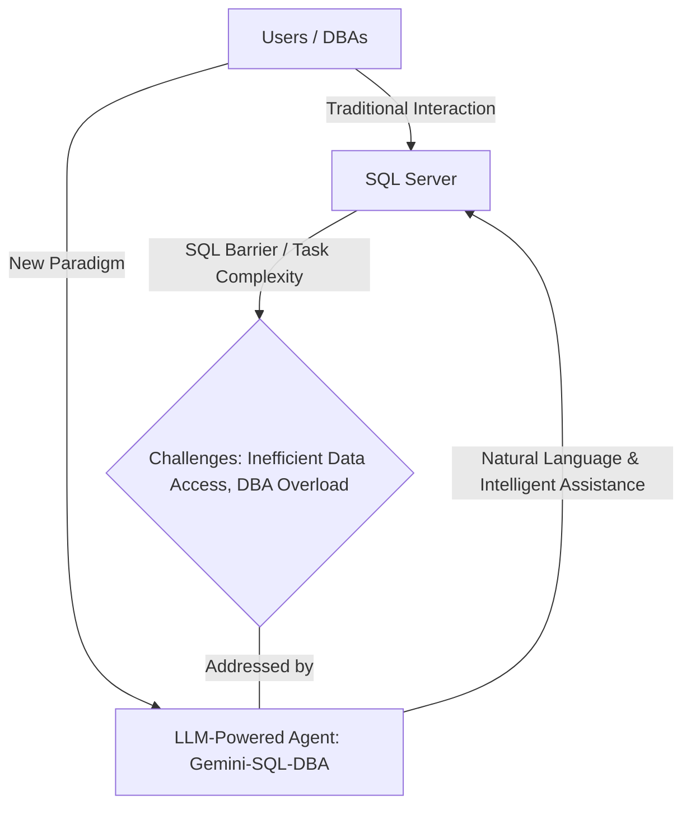
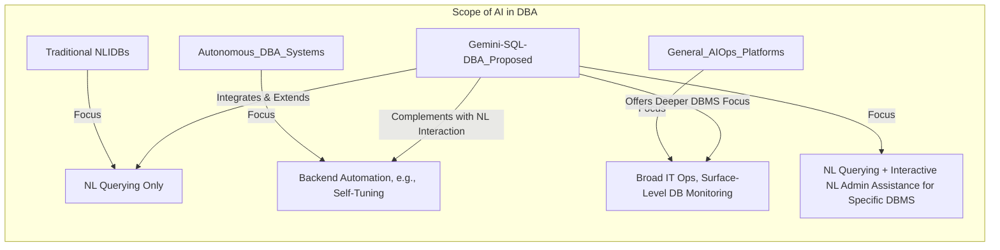
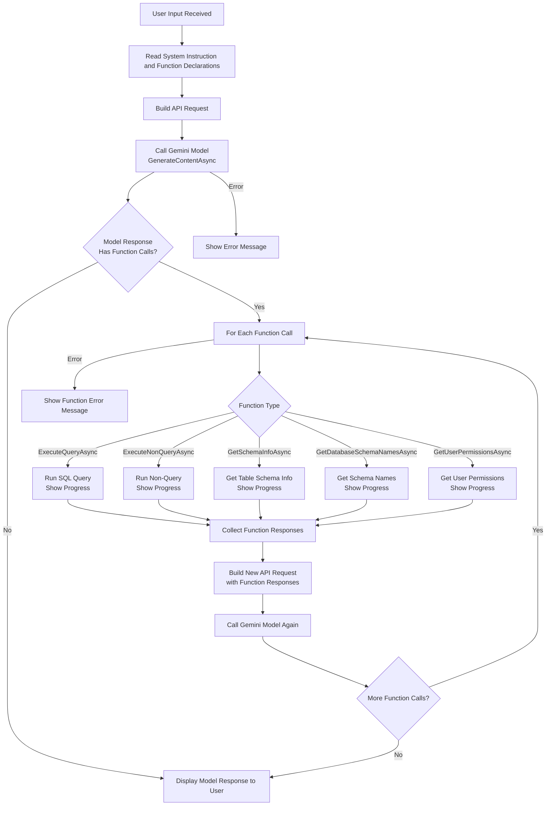
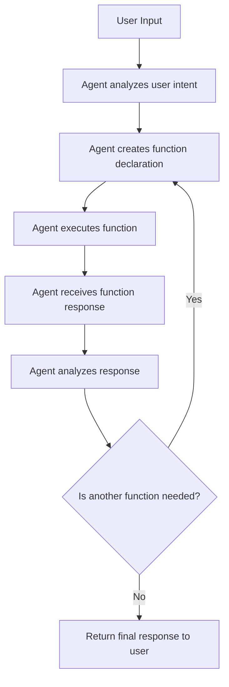

# **Gemini-SQL-DBA: An LLM-Powered Agent for Enhanced SQL Server Administration and Natural Language Interaction**

---

# Abstract

The widespread adoption of SQL Server in enterprise environments presents ongoing challenges in database administration and user interaction. Complexities in SQL Server management and the prerequisite of SQL proficiency often create barriers for non-expert users seeking direct data access and impose significant workloads on Database Administrators (DBAs). This paper introduces **Gemini-SQL-DBA**, an intelligent agent leveraging Google's Gemini Large Language Model (LLM) to address these challenges. Gemini-SQL-DBA is designed with a dual role: first, to facilitate intuitive natural language interaction for data retrieval and schema comprehension, and second, to provide intelligent assistance and partial automation for a defined set of core SQL Server DBA operational tasks. Key functionalities include high-fidelity Natural Language to SQL (NL2SQL) translation, dynamic schema exploration and explanation, and support for ten critical DBA tasks such as performance monitoring, backup status verification, and basic index suggestions. The agent employs a modular architecture centered around the Gemini LLM, utilizing sophisticated prompt engineering strategies and contextual information derived from SQL Server's Dynamic Management Views (DMVs) and system catalog. Its efficacy is evaluated through a series of defined case studies on the AdventureWorksDW benchmark database. This research presents the novel design and prototypical implementation of Gemini-SQL-DBA, proposes a structured framework for applying LLMs to core DBA responsibilities, and provides initial empirical evidence of the agent's practical benefits in terms of NL2SQL accuracy and DBA task assistance. Ultimately, Gemini-SQL-DBA aims to democratize data access for a broader range of users and enhance the operational efficiency of SQL Server DBAs.

---

# 1. Introduction

## 1.1. The Indispensable Role and Challenges of SQL Server Management

Microsoft SQL Server stands as a cornerstone in the data management landscape for countless organizations, from small businesses to large multinational corporations. Its robust feature set, scalability, and integration within the broader Microsoft ecosystem have cemented its role in powering critical applications, supporting business intelligence, and managing vast repositories of enterprise data [Cite relevant industry reports or foundational texts on SQL Server's market share/importance]. The effective management and utilization of SQL Server instances are, therefore, paramount to operational continuity and data-driven decision-making.

However, despite its power, interacting with and administering SQL Server presents significant challenges. For end-users, particularly those in non-technical roles such as business analysts or domain experts, the primary barrier is often the Structured Query Language (SQL) itself. While SQL is the standard for relational database interaction, mastering its syntax, understanding complex database schemas, and formulating efficient queries require specialized knowledge and considerable practice [Cite works on usability of SQL or data literacy]. This "SQL skill barrier" often results in users being unable to directly access and analyze data, leading to reliance on IT departments or DBAs, causing delays and hindering agile data exploration.

For Database Administrators (DBAs), the challenges are multifaceted. The sheer volume of data, coupled with the increasing complexity of database environments and performance expectations, places a heavy burden on DBAs [Cite works on DBA workload or challenges]. Their responsibilities span a wide array of critical tasks, including performance tuning, ensuring high availability and disaster recovery, managing security, performing routine maintenance, and troubleshooting issues. Many of these tasks, while crucial, can be repetitive and time-consuming. Furthermore, the demand for skilled DBAs often outstrips supply, placing additional pressure on existing teams to manage more with less [Cite sources on DBA skill shortage if available]. These challenges collectively underscore a pressing need for more intelligent, accessible, and efficient solutions for both SQL Server interaction and administration.

## 1.2. The Promise of Large Language Models (LLMs) in Database Contexts

The recent advancements in Large Language Models (LLMs) have demonstrated transformative potential across numerous domains, including natural language understanding, complex reasoning, and code generation [Cite seminal LLM papers like Vaswani et al. for Transformers, Devlin et al. for BERT, Brown et al. for GPT-3, and official Google announcements for Gemini]. LLMs, pre-trained on vast textual and code corpora, exhibit remarkable capabilities in interpreting human language intent and translating it into structured formats or executable code.

Within the database context, models like Google's Gemini [Cite Gemini technical report/announcement] offer significant promise. Their sophisticated understanding of language nuances makes them prime candidates for:
*   **Natural Language to SQL (NL2SQL) Translation:** Accurately converting user questions posed in everyday language into complex SQL queries, thereby democratizing data access.
*   **Explanation and Summarization:** Articulating complex technical information, such as database schema structures, query execution plans, or error log messages, in an easily understandable natural language format.
*   **Code and Script Generation:** Assisting in the generation of SQL scripts for data manipulation, definition, or common administrative tasks based on high-level natural language instructions.

The ability of LLMs to engage in coherent, context-aware dialogue further opens possibilities for interactive problem-solving and guided task execution.

*Figure 1: Conceptual overview of challenges in SQL Server interaction and the proposed LLM-agent based solution.*

## 1.3. Proposed Solution: Gemini-SQL-DBA Agent

To address the aforementioned challenges, this paper introduces **Gemini-SQL-DBA**, an intelligent agent designed to enhance interaction with and administration of Microsoft SQL Server environments. The core hypothesis of this research is that an LLM-powered agent, specifically architected around Google's Gemini model, can significantly lower the barrier to SQL Server data access for end-users and streamline or partially automate key tasks for DBAs, thereby improving overall efficiency, data accessibility, and operational robustness.

The Gemini-SQL-DBA agent is envisioned as an intelligent "co-pilot" with two primary objectives:
1.  **To enable intuitive, natural language-driven data interaction:** This involves accurately translating user queries in natural language into executable SQL, allowing users to retrieve information and explore database schemas without requiring deep SQL knowledge.
2.  **To provide intelligent assistance and automation for core SQL Server DBA tasks:** This includes supporting a curated set of ten fundamental DBA responsibilities, ranging from performance monitoring and backup status checks to basic index suggestions and error log interpretation, by leveraging the LLM's analytical and generative capabilities.

By integrating the advanced natural language processing power of Gemini with specific knowledge of SQL Server's architecture and administrative interfaces (such as Dynamic Management Views - DMVs), Gemini-SQL-DBA aims to provide a more seamless, efficient, and user-friendly experience.

## 1.4. Research Questions and Contributions

This research seeks to investigate the efficacy and feasibility of the Gemini-SQL-DBA agent by addressing the following key research questions (RQs):

*   **RQ1:** How accurately and reliably can the Gemini-SQL-DBA agent, leveraging the Gemini LLM, translate diverse natural language questions into executable SQL queries against a standard, non-trivial SQL Server database schema (e.g., AdventureWorksDW)?
*   **RQ2:** To what extent can the Gemini-SQL-DBA agent effectively provide correct information, generate useful scripts, or offer valid suggestions for the ten identified core SQL Server DBA tasks?
*   **RQ3:** What are the practical challenges, limitations (e.g., in terms of prompt engineering, context management, LLM "hallucinations"), and potential mitigation strategies when employing a general-purpose LLM like Gemini for specialized SQL Server administration and querying tasks?

The primary contributions of this paper are:
1.  **The design and prototypical implementation of Gemini-SQL-DBA:** A novel agent architecture specifically tailored for SQL Server, utilizing the Gemini LLM as its core reasoning and generation engine.
2.  **A curated framework for LLM application to core DBA tasks:** Identification and detailed mapping of ten essential SQL Server DBA tasks amenable to LLM-based assistance, along with strategies for their implementation using natural language prompts and SQL Server's system interfaces.
3.  **Empirical evaluation of the agent's capabilities:** An assessment of Gemini-SQL-DBA's performance on NL2SQL and selected DBA tasks through defined case studies on the AdventureWorksDW database, providing initial evidence of its utility.
4.  **Insights into prompt engineering for SQL Server:** A discussion of effective prompt design techniques for guiding the Gemini LLM to perform specialized SQL Server-related functions.
5.  **A critical analysis of limitations and future research directions:** Highlighting the challenges encountered and outlining avenues for further development in creating more robust and comprehensive AI-powered DBA assistants.

## 1.5. Paper Organization

The remainder of this paper is structured as follows: 
*   Section 2 reviews related work in Natural Language Interfaces to Databases (NLIDBs) and AI in database administration.
*   Section 3 details the design and architecture of the Gemini-SQL-DBA agent. 
*   Section 4 describes the implementation specifics of the prototype. 
*   Section 5 presents the evaluation methodology, case studies, and discusses the results. 
*   Section 6 elaborates on the challenges, limitations, and ethical considerations. 
*   Section 7 outlines future work and Section 8 concludes the paper.

---

# 2. Related Work

This section situates Gemini-SQL-DBA within the broader landscape of research in Natural Language Interfaces to Databases (NLIDBs), AI in Database Administration (DBA), and LLMs for code-related tasks. We highlight existing approaches and delineate the specific contributions and novelty of our proposed agent.

## 2.1. Natural Language Interfaces to Databases (NLIDBs)

The ambition to enable users to query databases using natural language dates back several decades, giving rise to a rich field of NLIDB research.

### 2.1.1. Traditional Approaches
Early NLIDB systems often relied on **rule-based methods**, employing hand-crafted grammars and lexicons to parse natural language questions and map them to SQL queries [Cite seminal works like LUNAR or early rule-based systems]. These systems, while effective in constrained domains, faced challenges in terms of scalability, portability to new domains, and robustness to linguistic variations [2]. **Semantic parsing** techniques subsequently emerged, focusing on mapping natural language utterances to intermediate meaning representations (e.g., logical forms) that could then be translated to SQL [Cite key semantic parsing papers, e.g., Zelle & Mooney, Woods]. These often involved complex parsing algorithms and domain-specific knowledge engineering. Other traditional approaches included pattern matching and keyword-based systems, which offered simplicity but limited expressiveness and accuracy for complex queries [2]. While foundational, these methods generally required significant manual effort for development and adaptation.

### 2.1.2. Deep Learning and LLMs for NL2SQL
The advent of deep learning, particularly sequence-to-sequence (Seq2Seq) models and Transformer architectures [Cite Vaswani et al., 2017], revolutionized the NLIDB field, leading to the sub-field often termed NL2SQL. Models like T5 [Cite Raffel et al., 2020], BERT [Cite Devlin et al., 2019], and various GPT congeners [Cite Radford et al., OpenAI papers] pre-trained on vast text and code corpora, demonstrated remarkable improvements in understanding natural language and generating SQL queries. Several surveys provide comprehensive overviews of these advancements [1, 3, 4, 5].

Significant research has focused on enhancing LLM performance for NL2SQL through various strategies, including schema linking (correctly mapping natural language phrases to database schema elements), value grounding, and handling complex query structures like joins, aggregations, and nested queries [4]. Frameworks such as LangChain [LangChain Project] have emerged to simplify the development of LLM-powered applications, including NL2SQL systems, by providing tools for prompt management, context injection, and agentic behavior.

Publicly available benchmarks like WikiSQL [Cite Zhong et al., 2017], Spider [Cite Yu et al., 2018], SParC [Cite Yu et al., 2019], and CoSQL [Cite Yu et al., 2019] have been crucial in driving progress and allowing for systematic comparison of different NL2SQL models [1, 4]. More recent benchmarks like BIRD [Cite Li et al., 2023] aim to evaluate LLMs on more realistic and challenging enterprise scenarios [2]. Models like OpenAI's GPT-4, Google's Gemini [Cite Gemini Team, Google, 2023], and others have shown state-of-the-art performance on many of these benchmarks, often through sophisticated prompt engineering or fine-tuning techniques [2, 3].

*   **Distinction of Gemini-SQL-DBA:** While Gemini-SQL-DBA leverages these LLM advancements for its NL2SQL capabilities, its novelty lies in:
    *   Focusing specifically on SQL Server as the target RDBMS, allowing for tailored prompt engineering and utilization of SQL Server-specific features and metadata.
    *   Integrating NL2SQL with a broader suite of DBA assistance tasks, moving beyond query generation to a more holistic database interaction agent.
    *   Aiming to provide an interactive, "co-pilot" experience rather than solely a black-box translation service.

## 2.2. AI and Automation in Database Administration

The application of AI to automate and enhance DBA tasks is another active area of research, driven by the increasing complexity and scale of modern database systems.

### 2.2.1. Automated Performance Tuning
Significant research has been dedicated to **autonomous or self-tuning database systems**. These systems aim to automatically optimize database performance by adjusting configuration parameters, managing indexes, and refining query execution plans without human intervention. Early work in this area includes projects like Microsoft's AutoAdmin [Cite Chaudhuri and Narasayya, VLDB 1997] which focused on automated index and statistics management. More recent commercial offerings like Oracle's Autonomous Database [Oracle Autonomous Database] and academic research explore using machine learning, including reinforcement learning, to dynamically tune various aspects of database performance [1, 2, 3]. These systems often operate as backend optimizers with limited direct natural language interaction capabilities for administrative tasks.

### 2.2.2. Anomaly Detection and Predictive Maintenance
AI, particularly machine learning, is increasingly used for **anomaly detection** in database workloads, performance metrics, and security logs [1, 2, 3, 4, 5]. By learning baseline behaviors, these systems can identify unusual patterns that may indicate impending failures, performance degradation, or security breaches, enabling proactive intervention [2, 4]. Predictive maintenance, leveraging historical data and sensor telemetry (where applicable), aims to forecast component failures or maintenance needs, thereby improving system reliability and reducing downtime [1].

### 2.2.3. AI-Powered Chatbots/Assistants for IT Operations (AIOps)
The broader field of **AIOps (Artificial Intelligence for IT Operations)** leverages big data, machine learning, and analytics to automate and enhance IT operational workflows, including event correlation, root cause analysis, and incident remediation [1, 2, 3]. AI-powered chatbots and virtual assistants are emerging in this space to provide instant support, handle routine queries, and guide IT staff through troubleshooting procedures [1, 4]. While AIOps platforms can offer insights into database performance as part of the overall IT infrastructure, dedicated, conversational AI agents deeply integrated with specific DBMS administration tasks are less common. Some AIOps tools can provide unified visibility across infrastructure, applications, and databases, but often lack the deep, interactive, and generative capabilities for specific database systems like SQL Server [5].

*Figure 2: Positioning of Gemini-SQL-DBA relative to related AI system categories for database interaction and management.*

*   **Distinction of Gemini-SQL-DBA:**
    *   Unlike fully autonomous backend tuning systems (B), Gemini-SQL-DBA emphasizes an *interactive* assistance model (D1), where the DBA or user can query the agent in natural language for specific information, explanations, or script generation related to administrative tasks.
    *   It aims to provide a conversational interface for a defined set of common SQL Server DBA tasks, rather than solely focusing on automated anomaly detection or a broad IT operational overview (C1).
    *   While building on NLIDB principles (A1), it extends beyond pure querying to encompass administrative support.
    *   The use of a powerful generative LLM like Gemini allows for more flexible interaction and explanation capabilities compared to traditional rule-based or specialized ML models for individual DBA tasks.

*   **Positioning of Gemini-SQL-DBA:**
    *   **NLIDB (A)**: Traditional NLIDBs focus primarily on natural language querying, often with limited capabilities for administrative tasks.
    *   **Autonomous DBA Systems (B)**: These systems automate backend processes but may not provide interactive assistance or natural language interfaces.
    *   **General AIOps Platforms (C)**: These platforms offer broad IT operations support but may lack the depth of interaction and specific focus on SQL Server administration.
 
## 2.3. LLMs in Software Engineering and Code Generation

The proficiency of LLMs in understanding and generating code has significantly impacted software engineering. Tools like GitHub Copilot [GitHub Copilot], OpenAI's Codex [Cite Chen et al., 2021 - Codex], Amazon CodeWhisperer, and models like AlphaCode [Cite Li et al., 2022 - AlphaCode] demonstrate the ability of LLMs to assist developers with code completion, bug fixing, generating unit tests, and even creating entire code snippets from natural language descriptions [1, 2, 3, 4, 5]. This capability is directly relevant to Gemini-SQL-DBA's function of generating SQL queries and T-SQL scripts for maintenance tasks, as SQL is a formal programming language. Research in this area also explores benchmarks for evaluating LLM-generated code [3] and prompt engineering techniques to improve code quality and correctness [3, 4].

The proven success of LLMs in general code generation provides a strong foundation for their application in generating SQL. Gemini-SQL-DBA specifically applies these code generation capabilities to the SQL dialect and common scripting patterns used in SQL Server administration.

## 2.4. Research Gap and Novelty

While the aforementioned areas have seen substantial progress, several gaps remain that Gemini-SQL-DBA aims to address:

1.  **Integrated NL Interaction for Querying and Administration:** Most NLIDB systems focus solely on NL2SQL for data retrieval. Conversely, AI-driven DBA tools often lack sophisticated natural language interaction or are geared towards backend automation rather than interactive assistance. There is a need for agents that seamlessly integrate natural language querying with natural language-driven assistance for a broader range of common administrative tasks for a specific DBMS. (Refer to Figure 2 for visual positioning).
2.  **DBMS-Specific Conversational Agents:** Many LLM applications are generic or require extensive customization for specific database systems. A dedicated agent, like Gemini-SQL-DBA for SQL Server, can leverage knowledge of the specific DMVs, system procedures, error messages, and common administrative patterns of that DBMS, potentially leading to more accurate and relevant assistance.
3.  **Leveraging State-of-the-Art Generative LLMs (like Gemini) for DBA Co-Pilots:** While earlier AI techniques have been applied to DBA tasks, the unique generative, explanatory, and conversational capabilities of advanced LLMs like Gemini offer new possibilities for creating powerful "co-pilot" assistants for DBAs and democratizing database interaction for a wider audience.
4.  **Focus on Practical DBA Task Assistance Beyond Pure Automation:** Gemini-SQL-DBA emphasizes not just automation, but also providing explanations, generating scripts for review, and offering guidance, aligning with a human-in-the-loop philosophy where the agent augments rather than entirely replaces the DBA or knowledgeable user for critical tasks.

The novelty of Gemini-SQL-DBA lies in its synergistic approach: combining robust NL2SQL capabilities with intelligent assistance for a curated set of core SQL Server DBA tasks, all powered by the advanced reasoning and generative power of the Gemini LLM, and delivered through an interactive, conversational interface. Our work focuses on the practical design, implementation, and evaluation of such an agent specifically for the SQL Server ecosystem.

